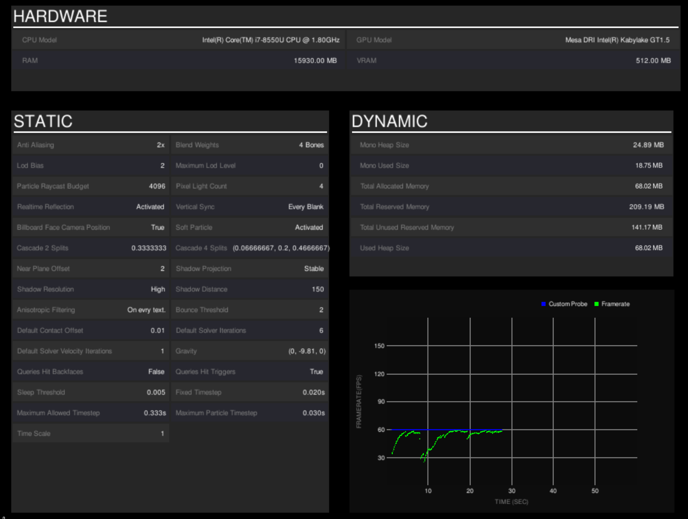

.. _learn_step_by_step_quick_start:

Quick Start
===========

.Profile is built to be incredibly easy to use, in here, you're going to find two sections, one will get you running
with no work, and the other is a bit more manual, but provides you more control.

Quickest Start
--------------
Simply add the script Bootstrap.cs to a game object in your scene and press play! This will automatically create a fully
functioning Profile, that tracks a lot of data, you can toggle the profile visual display by pressing the A key, you
should be presented with an overview of performance metrics ...

If that's all you need, you're now done, you can ship your product to customers and they'll be able to visualise
performance data, your internal QA team can use it to track performance across a number of devices, or you can use it
yourself to get high on your supremely optimised code.

Slightly less Quick Start
-------------------------

For those of you who want to know more about what's going on under the hood, you can follow this quick start. If you're
not interested in going into more detail about managing profiling sessions, you can skip this section.

We'll take you through the basics of setting up a simple profiling session from scratch. During this quick start, we'll
assume that you already have some code that you'd like to use to setup a profiling session, this could be anything from
a simple cs script with an OnStart Method to a complex FSM.

1) Decide where you'd like to create and maintain your profile session
2) Add the required using

    .. code-block:: c#

        using WellFired.Profile.Probes;
        using WellFired.Profile.ProfileProcessor;
        using WellFired.Profile.Unity.Runtime;

3) Create a new Profiling Session

    .. code-block:: c#

        // Create a new session.
        var session = DotProfileSession.New();

4) Tell your session what data you'd like it to track using one of the provided defaults

    .. code-block:: c#

        // Track Continuous framerate
        session.Track(Defaults.Continuous);

5) Tell your session how to process the recorded data

    .. code-block:: c#

        // Process recorded data using the built in visual display extension
        session.ProcessData(new VisualProcessor(() => Input.GetKeyDown(KeyCode.A)));

6) Tell the session to start recording

    .. code-block:: c#

        session.StartRecording();

7) Optionally tell the session to stop recording

    .. code-block:: c#

        session.StopRecording();

8) Execute your code and you will have a complete profiling session with instant display.

And Then?
---------

Although we glossed over most core concepts of .Profile, you've learned the basic interface for a session, how to
maintain one, track and display certain aspects. In the following sections, we'll go into more detail about how exactly
Tracking and Processing works, as well as allowing you to completely customise .Profile.

If you want more information now, feel free to check out our API, specifically our built in tracker
:ref:`Defaults<classwellfired_profile_unity_runtime_defaults>`.